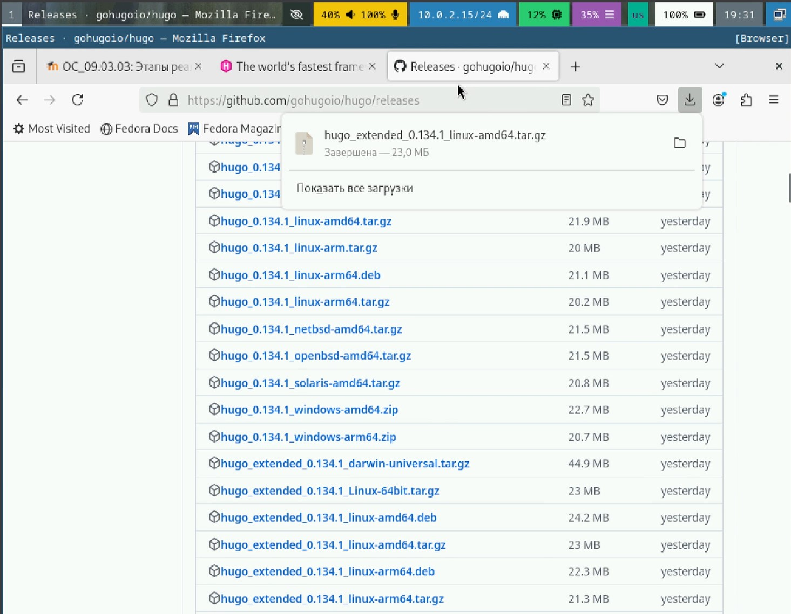

---
## Front matter
lang: ru-RU
title: Индивидуальный проект
subtitle: Этап 1
author:
  - Габралян Г. А.
institute:
  - Российский университет дружбы народов, Москва, Россия

## i18n babel
babel-lang: russian
babel-otherlangs: english

## Formatting pdf
toc: false
toc-title: Содержание
slide_level: 2
aspectratio: 169
section-titles: true
theme: metropolis
header-includes:
 - \metroset{progressbar=frametitle,sectionpage=progressbar,numbering=fraction}
 - '\makeatletter'
 - '\beamer@ignorenonframefalse'
 - '\makeatother'
 
## Fonts
mainfont: PT Serif
romanfont: PT Serif
sansfont: PT Sans
monofont: PT Mono
mainfontoptions: Ligatures=TeX
romanfontoptions: Ligatures=TeX
sansfontoptions: Ligatures=TeX,Scale=MatchLowercase
monofontoptions: Scale=MatchLowercase,Scale=0.9
---

# Информация

## Докладчик

:::::::::::::: {.columns align=center}
::: {.column width="70%"}

  * Габралян Георгий Александрович
  * Студент
  * Российский университет дружбы народов

:::
::: {.column width="30%"}

:::
::::::::::::::

## Цель

Создать сайт на платформе Hugo и разместить его на github

## Задачи

Установить необходимое программное обеспечение.  
Скачать шаблон темы сайта.  
Разместить его на хостинге git.  
Установить параметр для URLs сайта.  
Разместить заготовку сайта на Github pages.  

## Скачивание Hugo

Для начала скачаем hugo

{height=40%}

## Установка Hugo

Распакуем его и установим, перенеся в /usr/local/bin 

{height=40%}

## Создание репозитория

Создадим из предложенного шаблона сайта репозиторий 

{height=40%}

## Клонирование репозитория

Клонируем репозиторий 

{height=40%}

## Установка Go

Установим Go (он нужен для запуска сайта)

{height=40%}

## Запуск сайта

Запустим наш сайт командой Hugo server 

{height=40%}

## Создание репозитория

Создадим репозиторий, на котором наш сайт будет хоститься 

{height=40%}

## Клонирование репозитория

Клонируем только что созданный репозиторий, предварительно удалив папку public в папке blog

{height=40%}

## Создание README и загрузка изменений

Создадим файл README для склонированного репозитория и загрузим изменения

{height=40%}

## Настройка сабмодуля

Делаем клонированный репозиторий сабмодулем нашего первого репозитория blog

{height=40%}

## Запуск сайта

Запустим наш сайт ещё раз, чтобы прогрузить изменения в public

{height=40%}

## Загрузка изменений в public

Выложим изменения в public на github

{height=40%}

## Внешний вид сайта

Так теперь выглядит сайт на собственном домене

{height=40%}

## Выводы

В результате выполнения лабораторной работы был создан сайт из шаблона
