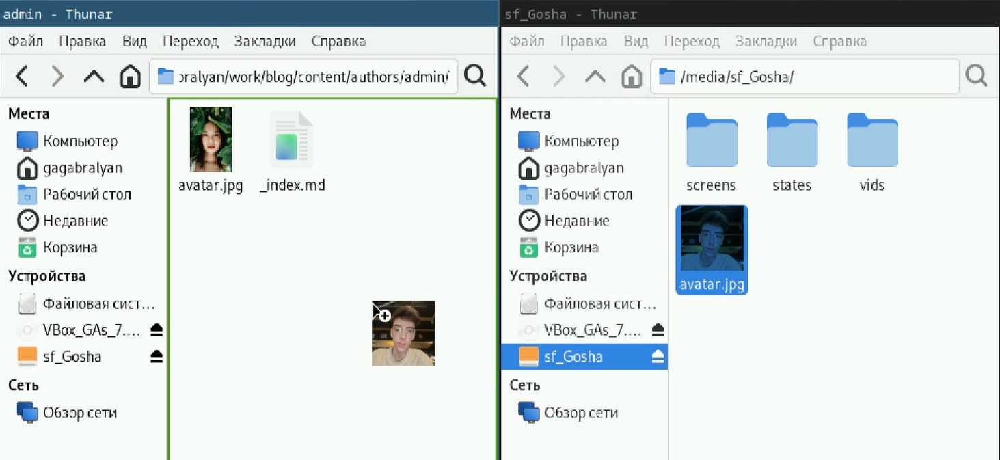
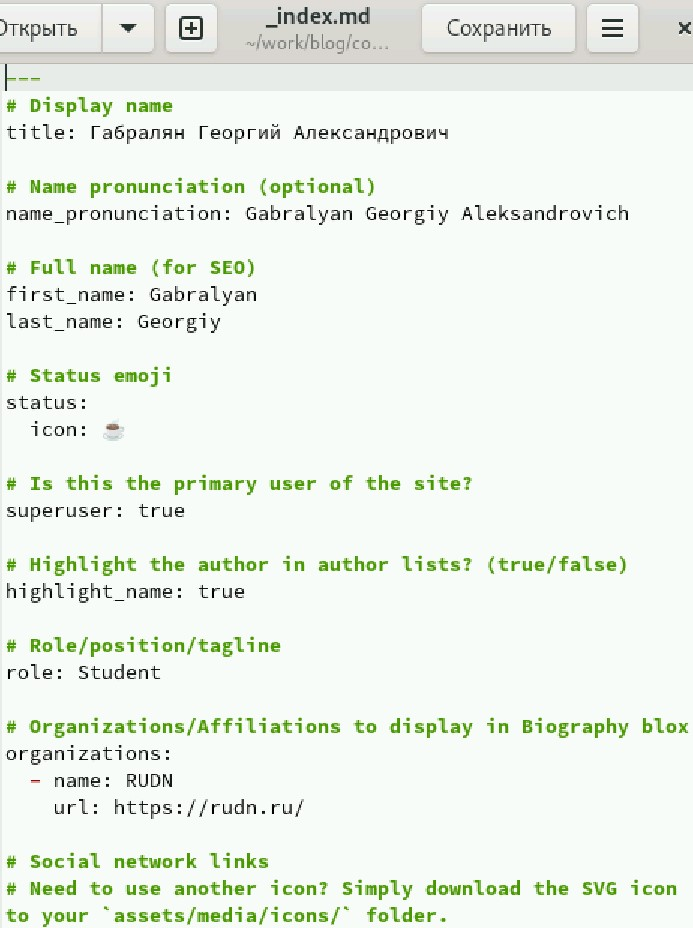
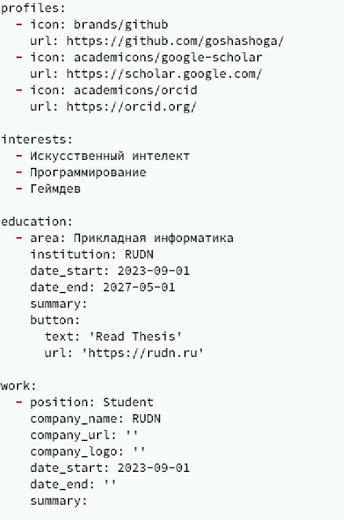
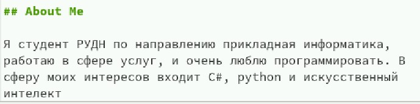
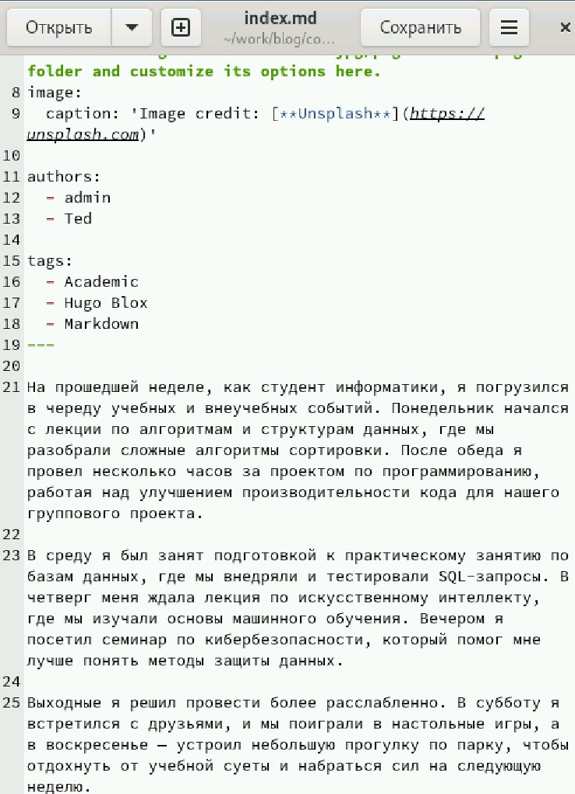
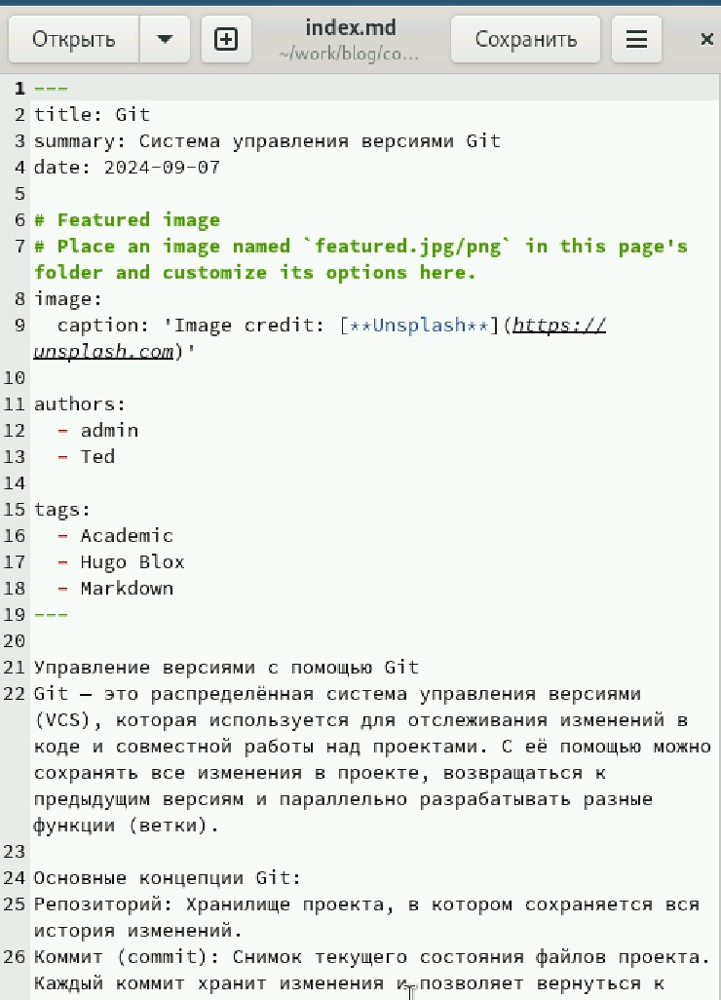
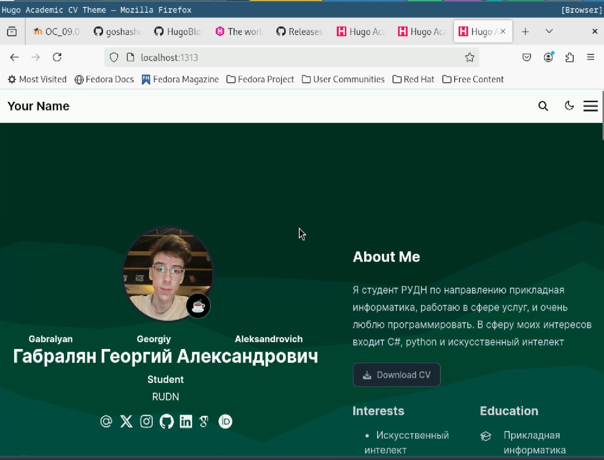

---
## Front matter
lang: ru-RU
title: Индивидуальный проект
subtitle: Этап 2
author:
  - Габралян Г. А.
institute:
  - Российский университет дружбы народов, Москва, Россия

## i18n babel
babel-lang: russian
babel-otherlangs: english

## Formatting pdf
toc: false
toc-title: Содержание
slide_level: 2
aspectratio: 169
section-titles: true
theme: metropolis
header-includes:
 - \metroset{progressbar=frametitle,sectionpage=progressbar,numbering=fraction}
 - '\makeatletter'
 - '\beamer@ignorenonframefalse'
 - '\makeatother'
 
## Fonts
mainfont: PT Serif
romanfont: PT Serif
sansfont: PT Sans
monofont: PT Mono
mainfontoptions: Ligatures=TeX
romanfontoptions: Ligatures=TeX
sansfontoptions: Ligatures=TeX,Scale=MatchLowercase
monofontoptions: Scale=MatchLowercase,Scale=0.9
---

# Информация

## Докладчик

:::::::::::::: {.columns align=center}
::: {.column width="70%"}

  * Габралян Георгий Александрович
  * Студент
  * Российский университет дружбы народов

:::
::: {.column width="30%"}

:::
::::::::::::::

## Цель

Создать свой собственный сайт на Hugo по инсткурции 

## Задачи

Разместить фотографию владельца сайта.  
Разместить краткое описание владельца сайта (Biography).  
Добавить информацию об интересах (Interests).  
Добавить информацию от образовании (Education).  
Сделать пост по прошедшей неделе.  
Добавить пост на тему по выбору  

## Замена аватарки

Заменим аватарку на свою в папке content/authors/admin 

{height=40%}

## Замена имени

В той же папке откроем файл _index.md (в последующем мы почти всегда будем его редактировать) и изменим имя на своё

{height=40%}

## Интересы и образование

Напишем свои интересы и образование

{height=40%}

## Информация о себе

И напишем информацию о себе

{height=40%}

## Пост о прошедшей неделе

Напишем пост о прошедшей неделе в папке content/posts (в последующем именно там мы всегда будем писать посты) 

{height=40%}

## Пост о Git

Теперь напишем пост о Git

{height=40%}

## Внешний вид сайта с изменениями

Теперь так выглядит наш сайт

{height=40%}

## Выводы

В сайт были внесены изменения (фото, интересы и биография)
