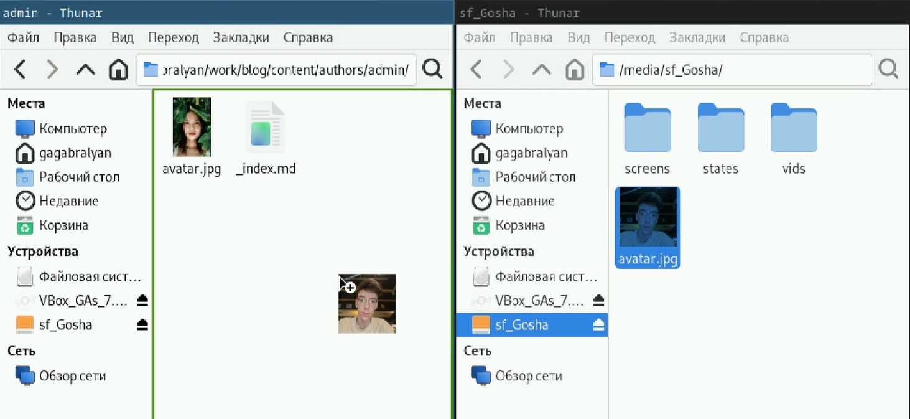
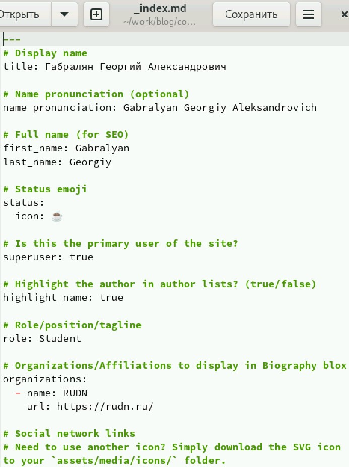
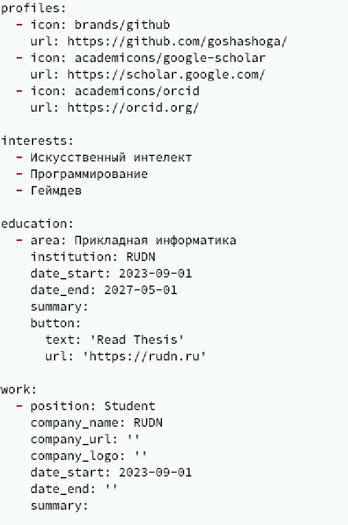
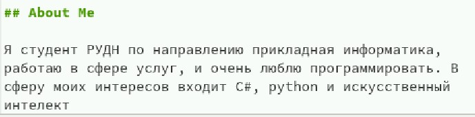
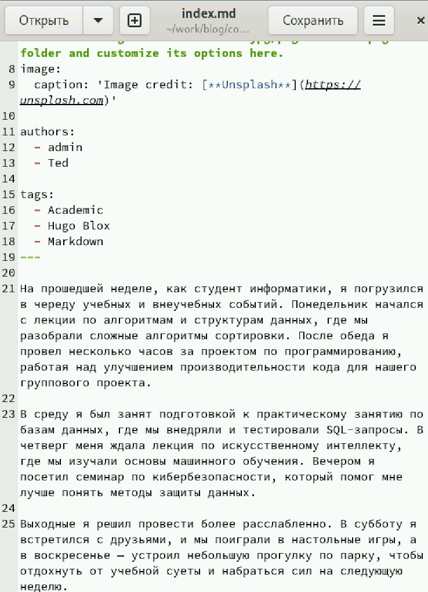
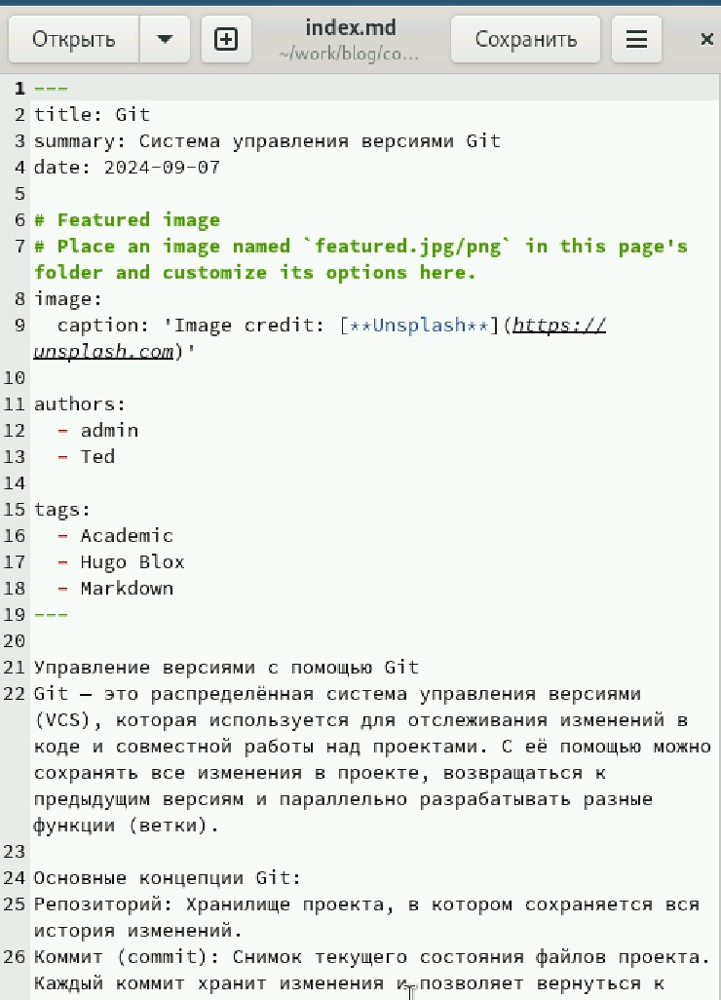
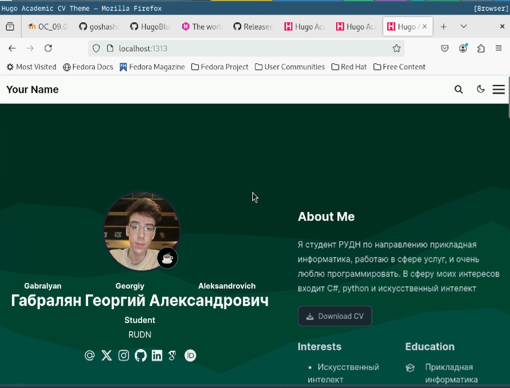

---
## Front matter
title: "Отчёт по индивидуальному проекту"
subtitle: "Часть 2"
author: "Габралян Георгий Александрович"

## Generic otions
lang: ru-RU
toc-title: "Содержание"

## Bibliography
bibliography: bib/cite.bib
csl: pandoc/csl/gost-r-7-0-5-2008-numeric.csl

## Pdf output format
toc: true # Table of contents
toc-depth: 2
lof: true # List of figures
lot: true # List of tables
fontsize: 12pt
linestretch: 1.5
papersize: a4
documentclass: scrreprt
## I18n polyglossia
polyglossia-lang:
  name: russian
  options:
	- spelling=modern
	- babelshorthands=true
polyglossia-otherlangs:
  name: english
## I18n babel
babel-lang: russian
babel-otherlangs: english
## Fonts
mainfont: PT Serif
romanfont: PT Serif
sansfont: PT Sans
monofont: PT Mono
mainfontoptions: Ligatures=TeX
romanfontoptions: Ligatures=TeX
sansfontoptions: Ligatures=TeX,Scale=MatchLowercase
monofontoptions: Scale=MatchLowercase,Scale=0.9
## Biblatex
biblatex: true
biblio-style: "gost-numeric"
biblatexoptions:
  - parentracker=true
  - backend=biber
  - hyperref=auto
  - language=auto
  - autolang=other*
  - citestyle=gost-numeric
## Pandoc-crossref LaTeX customization
figureTitle: "Рис."
tableTitle: "Таблица"
listingTitle: "Листинг"
lofTitle: "Список иллюстраций"
lotTitle: "Список таблиц"
lolTitle: "Листинги"
## Misc options
indent: true
header-includes:
  - \usepackage{indentfirst}
  - \usepackage{float} # keep figures where there are in the text
  - \floatplacement{figure}{H} # keep figures where there are in the text
---

# Цель работы

Создать свой собственный сайт на Hugo [@hugo] по инсткурции [@tuis]

# Задание

Разместить фотографию владельца сайта.  
Разместить краткое описание владельца сайта (Biography).  
Добавить информацию об интересах (Interests).  
Добавить информацию от образовании (Education).  
Сделать пост по прошедшей неделе.  
Добавить пост на тему по выбору  

# Выполнение лабораторной работы

Заменим аватарку на свою в папке content/authors/admin (рис. [-@fig:001]).

{#fig:001}

В той же папке откроем файл _index.md (в последующем мы почти всегда будем его редактировать) и изменим имя на своё (рис. [-@fig:002]).

{#fig:002}

Напишем свои интересы и образование (рис. [-@fig:003]).

{#fig:003}

И напишем информацию о себе (рис. [-@fig:004]).

{#fig:004}

Напишем пост о прошедшей неделе в папке content/posts (в последующем именно там мы всегда будем писать посты) (рис. [-@fig:005]).

{#fig:005}

Теперь напишем пост о Git (рис. [-@fig:006]).

{#fig:006}

Теперь так выглядит наш сайт (рис. [-@fig:007]).

{#fig:007}

# Выводы

В сайт были внесены изменения (фото, интересы и биография)

# Список литературы{.unnumbered}

::: {#refs}
:::
