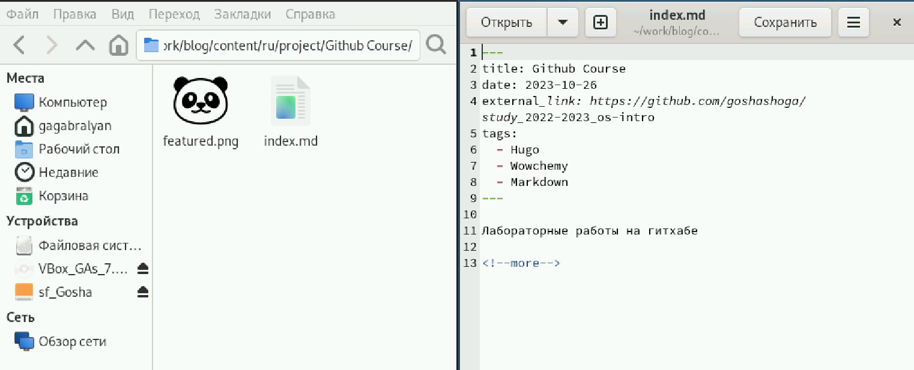
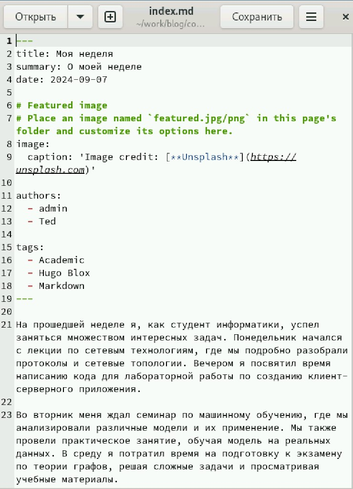
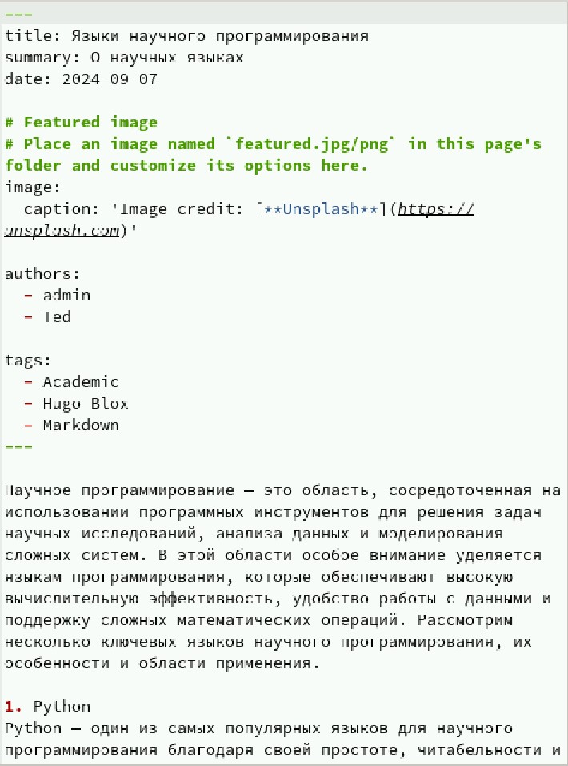

---
## Front matter
lang: ru-RU
title: Индивидуальный проект
subtitle: Этап 5
author:
  - Габралян Г. А.
institute:
  - Российский университет дружбы народов, Москва, Россия

## i18n babel
babel-lang: russian
babel-otherlangs: english

## Formatting pdf
toc: false
toc-title: Содержание
slide_level: 2
aspectratio: 169
section-titles: true
theme: metropolis
header-includes:
 - \metroset{progressbar=frametitle,sectionpage=progressbar,numbering=fraction}
 - '\makeatletter'
 - '\beamer@ignorenonframefalse'
 - '\makeatother'
 
## Fonts
mainfont: PT Serif
romanfont: PT Serif
sansfont: PT Sans
monofont: PT Mono
mainfontoptions: Ligatures=TeX
romanfontoptions: Ligatures=TeX
sansfontoptions: Ligatures=TeX,Scale=MatchLowercase
monofontoptions: Scale=MatchLowercase,Scale=0.9
---

# Информация

## Докладчик

:::::::::::::: {.columns align=center}
::: {.column width="70%"}

  * Габралян Георгий Александрович
  * Студент
  * Российский университет дружбы народов

:::
::: {.column width="30%"}

:::
::::::::::::::

## Цель

Создать свой собственный сайт на Hugo по инсткурции

## Задачи

Сделать записи для персональных проектов.  
Сделать пост по прошедшей неделе.  
Добавить пост на тему по выбору.  

## Информация о курсе

В папке project добавим папку, куда мы запишем информацию о нашем проеке - проходимом курсе по АКИОС

{height=40%}

## Пост о неделе

Напишем пост о неделе

{height=40%}

## Пост о научных языках

Напишем пост о языках научного программирования

{height=40%}

## Выводы

На сайт были добавленны проекты и посты
