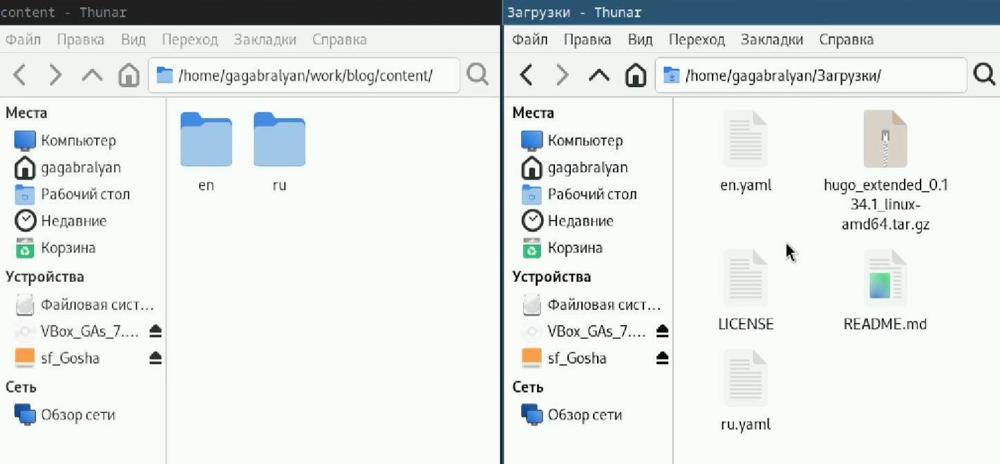
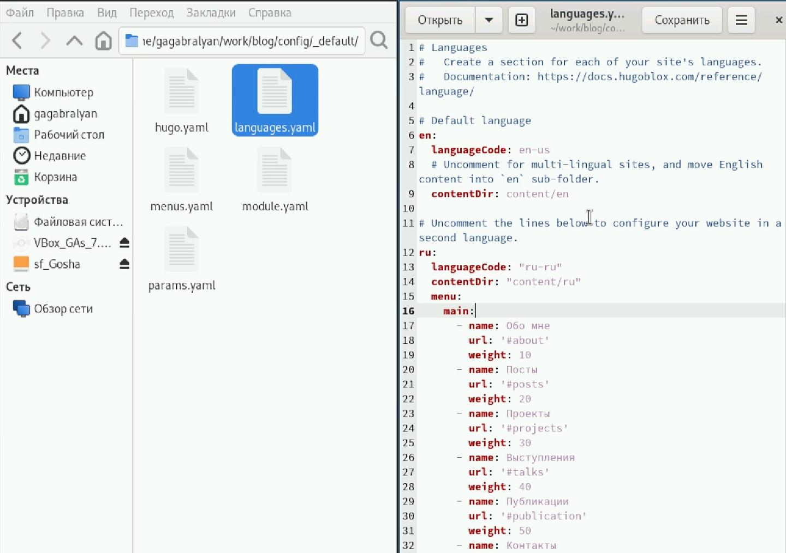
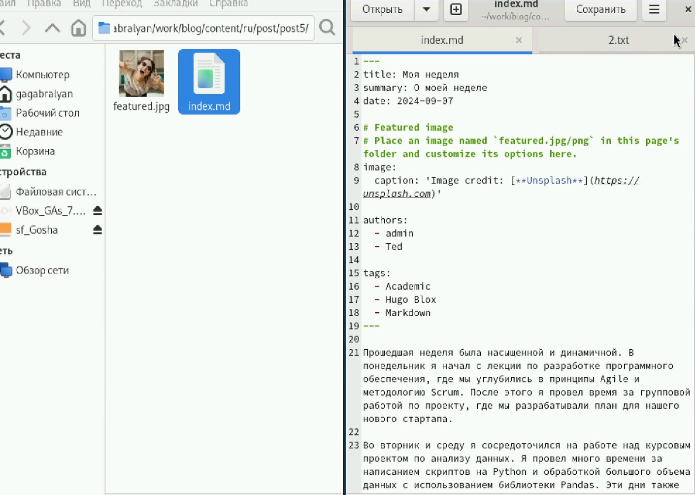
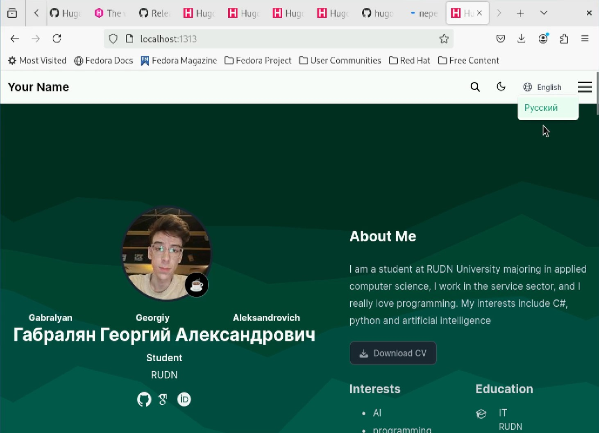

---
## Front matter
lang: ru-RU
title: Индивидуальный проект
subtitle: Этап 6
author:
  - Габралян Г. А.
institute:
  - Российский университет дружбы народов, Москва, Россия

## i18n babel
babel-lang: russian
babel-otherlangs: english

## Formatting pdf
toc: false
toc-title: Содержание
slide_level: 2
aspectratio: 169
section-titles: true
theme: metropolis
header-includes:
 - \metroset{progressbar=frametitle,sectionpage=progressbar,numbering=fraction}
 - '\makeatletter'
 - '\beamer@ignorenonframefalse'
 - '\makeatother'
 
## Fonts
mainfont: PT Serif
romanfont: PT Serif
sansfont: PT Sans
monofont: PT Mono
mainfontoptions: Ligatures=TeX
romanfontoptions: Ligatures=TeX
sansfontoptions: Ligatures=TeX,Scale=MatchLowercase
monofontoptions: Scale=MatchLowercase,Scale=0.9
---

# Информация

## Докладчик

:::::::::::::: {.columns align=center}
::: {.column width="70%"}

  * Габралян Георгий Александрович
  * Студент
  * Российский университет дружбы народов

:::
::: {.column width="30%"}

:::
::::::::::::::

## Цель

Создать свой собственный сайт на Hugo по инсткурции 

## Задачи

Сделать поддержку английского и русского языков.  
Разместить элементы сайта на обоих языках.  
Разместить контент на обоих языках.  
Сделать пост по прошедшей неделе.  
Добавить пост на тему по выбору (на двух языках)  

## Создание папок

Создадим 2 папки - ru и en, куда скопируем содержимое папки content, и переносим в них файлы ru.yaml и en.yaml соответственно 

{height=40%}

## Изменение файла languages.yaml

В папке config/_default/ меняем файл languages.yaml следующим образом. В файле index.md нашегей папки en переводим текст на английский текст

{height=40%}

## Пост о прошедшей неделе

Напишем пост о прошедшей неделе 

{height=40%}

## Внешний вид сайта

Теперь мы можем переключать язык на сайте и язык текста будет меняться

{height=40%}

## Выводы

Сайт был переведён на английский язык и были добавлены посты
